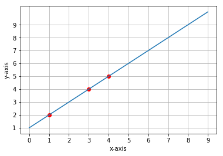
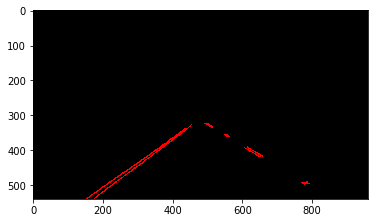

# Lane Detection

## Introduction

When approaching the problem of programming self driving cars, lane detection is a very immediate problem that one might encounter. Ensuring that the vehicle stays in the appropriate lane and responds to the twists and turns of the road is essential to creating a safe and functional self driving vehicle. In this project I will be outlining an image processing pipeline using the opencv library in python that can take images and videos as input and return the same images or videos with green lines fitted to the path of the immediate left and immediate right lane lines to the vehicle. 

## Pipeline

The pipeline for processing an image is about 7 steps and is outlined below:

1. Convert image to grayscale
2. Apply Gaussian blur to grayscale image
3. Apply Canny edge detection to the blurred image
4. Mask out region of image based on knowledge of camera position
5. Apply a Hough line transform to the masked out image
6. Fit a line to the left and right lane line segments
7. Add the fitted lines to the original image 

Here is the image we are starting with:


### Grayscale

The first step is to convert the image to grayscale. We convert the image to grayscale because we are not necessarily concerned with colors and working with a single channel image is less computationally expensive and less awkward than using a three channel image.


### Gaussian Blur

Next we prepare the image for Canny edge detection by using a Gaussian blur. Since the edges in the image are detected by looking for a high rate of change, adding a blur reduces the noise in the image and creates better edge lines. If a blur is not applied there will be false edge detection due to the noise. When using the blur you can set the kernel size which is the size of the mask matrix that passes over the image and computes averages. A lower size kernel will pick up noise easily and create a lot of distinct edges and a higher size kernel will pick up noise less but create less distinct edges. 


### Canny Edge Detection

Canny edge detection takes a blurred image and an upper and lower threshold. Canny edge detection is processed similarly to the Gaussian blur kernel using what is called a Sobel kernel. The Sobel kernel approximates the intensity gradient in the horizontal and vertical directions. If it falls within the upper and lower threshold then it is recognized as an edge. 


### Region Masking

The entire image should not concern us with the knowledge that the camera is in a fixed position on the vehicle. The part of the image we are actually concerned with is a trapezoid shape that starts at the bottom of the image near the left and right corners and ends near the horizontal center of the image and near the horizon line. We identify the approximate locations of the shape, create an image mask with the vertices of the shape, and use the bitwise_and function to apply the mask to the image which will black out everything not contained within the region defined by the supplied vertices.


### Hough Line Transform

The Hough line transform is a technique used to find lines in an edge detected image. At a high level it takes points in the image and describes them as sinusoidal curves where clustering of intersections identifies a line.   

To illustrate let's take a line in an image described by the two points (1, 2) and (4, 6)


We can calculate the slope with the slope formula:
```
(6 - 2)/(4 - 1) = 4/3
```

Next we calculate the y-intercept:
```
2 = (3/4)*1 + b // gives us a y intercept of 1.25 or 1 1/4
```

Now we can plot this line as a single point in a different parameter space using the slope and the y intercept because the equation of a line can be determined from those two values. 


We can additionally reason from a point in the image to a line in mb parameter space as well. The equation for a line in mb parameter space can be found with the following formula `b = y - xm`

To demonstrate let's plot the following points in the image space: (1, 2), (3, 4), (4, 5):


And now plotting the same points in the mb parameter space gives us:


We can see that all of the lines in the mb parameter space intersect at the point (1, 1) which means a line with a slope of 1 and a y-intercept of 1 should fit the points. We can test this by overlaying the line described by those two values on the points in our original graph:



Unfortunately this approach is imperfect because vertical lines have an infinite slope so instead we use polar coordinates in what is known as Hough space. The y-axis in Hough space is Rho which is the distance of the line from the origin and theta which is the angle away from the horizontal. This allows us to represent vertical lines without the infinite slope problem. Instead of generating straight lines a sinusoidal wave is generated in Hough space instead and the intersections of the curves are determined to be a line in the image space based on a voting procedure.



### Fitting Lines to Segments

The first step in fitting a left and right line to the detected lane lines is to determine which lines are part of the left lane and which are part of the right lane. We can imprecisely do this by creating an upper and lower threshold. In this case I used 0.8 and 0.3. We then calculate the slope of each line. If the line is between -0.8 and -0.3 we determine it is a left lane (it looks like it has a positive slope but remember the origin is in the upper left corner instead of the lower left corner). If the line is between 0.8 and 0.3 we determine it is a right lane. 

We can then take the average slope of all the lines in the left lane and the average slope of all the lines in the right lane and fit a line through our left and right lane line data by calculating the x values when y is at the bottom of the image and when y is slightly under the horizon given the equations of the lines and then take the average of those x values to plot the endpoints of the line.


### Weighted Image Addition

Lastly we use a weighted image addition to overlay the green lines onto the image with weight added to the green lines. If we were to use a normal add we would see the green lines start to disappear as they are added to whiter surfaces. 


## Possible Improvements

There seems to be a lot of noise that gets picked up near the top of the region mask which can lead to some line data that matches slope threshold to get put in the lane line lists which throws off the average by quite a bit. I think a possible solution would be to create a threshold on positional data as well to ensure there are no outliers. 

A region mask seems error prone due to different points where a camera could be fixed on a vehicle. I would assume that in a real scenario if a region mask is being used then the code would have more information about its position off the ground and on the vehicle and orientation angle so region boundaries could be calculated dynamically.

The challenge video has two problems. One is the heavy line curvature in the road and the other is the shadows. Fitting a curve to the data points might be a better choice and exploring additional denoising techniques.
